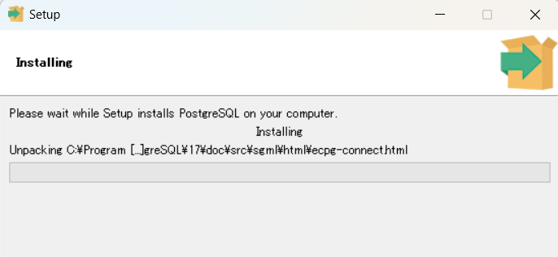
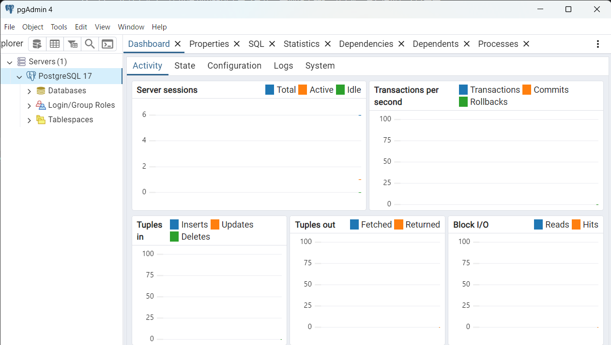

## データベースエンジンの種類
無料で使えるデータベースエンジンは以下のようなものがある。

MySQL:
世界で最も広く使用されているオープンソースのリレーショナルデータベース。
高速で信頼性が高く、GoogleやFacebookなどの大手企業でも使用されています。
PostgreSQL:
高機能で信頼性の高いオープンソースのリレーショナルデータベース。
複雑なクエリや大規模データの処理に優れており、商用データベースに匹敵する機能を持っています。
MariaDB:
MySQLから派生したオープンソースのリレーショナルデータベース。
MySQLとの互換性があり、性能向上のための独自機能が追加されています。
SQLite:
軽量で組み込み型のリレーショナルデータベース。
インストールが不要で、簡単に利用開始できるため、学習や小規模プロジェクトに適しています。
MongoDB:
ドキュメント指向のNoSQLデータベース。
高速でスケーラブルなデータベースで、JSON形式のデータを扱うのに適しています。

## PostgreSQLの活用手順
#### エンジンのインストール
https://postgresweb.com/how-to-install-postgresql13

1. 公式ページにアクセス
https://www.enterprisedb.com/postgresql-tutorial-resources-training-2?uuid=69f95902-b451-4735-b7e4-1b62209d4dfd&campaignId=postgres_rc_17

パスワード聞かれました。
インストール時にport聞かれました。
※PostgreSQLのポート番号は初期値では「5432」


2. データベース管理ツールのダウンロード
pgadminがおすすめらしい(基本1をインストール時にくっついてるみたい)
pgAdminとは、PostgreSQLのデータベース操作を画面でできるツール
https://www.pgadmin.org/download/



3. 


#### pythonで操作
```
pip install psycopg2
```

