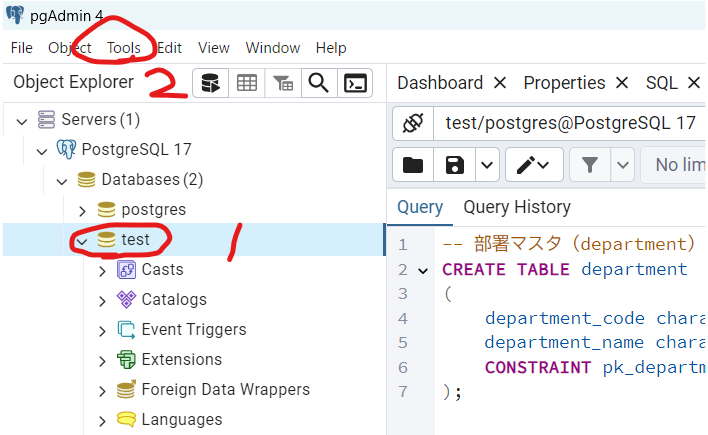

## データベースエンジンの種類
無料で使えるデータベースエンジンは以下のようなものがある。

MySQL:
世界で最も広く使用されているオープンソースのリレーショナルデータベース。
高速で信頼性が高く、GoogleやFacebookなどの大手企業でも使用されています。
PostgreSQL:
高機能で信頼性の高いオープンソースのリレーショナルデータベース。
複雑なクエリや大規模データの処理に優れており、商用データベースに匹敵する機能を持っています。
MariaDB:
MySQLから派生したオープンソースのリレーショナルデータベース。
MySQLとの互換性があり、性能向上のための独自機能が追加されています。
SQLite:
軽量で組み込み型のリレーショナルデータベース。
インストールが不要で、簡単に利用開始できるため、学習や小規模プロジェクトに適しています。
MongoDB:
ドキュメント指向のNoSQLデータベース。
高速でスケーラブルなデータベースで、JSON形式のデータを扱うのに適しています。

## スキーマ
データベースにおける「スキーマ」とは、データベースの構造や設計を定義するものです。具体的には、テーブル、ビュー、インデックス、制約、関数、トリガーなどのデータベースオブジェクトの定義を含みます。スキーマは、データベース内のデータの整理方法や関係性を示す設計図のようなものです。
スキーマの主な要素
テーブル:
データを行と列で構成された形式で格納する基本的なデータベースオブジェクトです。
各テーブルには、列（カラム）と行（レコード）があり、列にはデータ型が定義されています。
ビュー:
テーブルのデータを基にした仮想的なテーブルです。
クエリの結果を保存し、複雑なクエリを簡略化するために使用されます。
インデックス:
データベースの検索速度を向上させるためのデータ構造です。
特定の列に対してインデックスを作成することで、検索やクエリのパフォーマンスが向上します。
制約:
データの整合性を保つためのルールです。
例として、主キー制約、外部キー制約、一意性制約、チェック制約などがあります。
関数:
特定のタスクを実行するための再利用可能なコードブロックです。
データベース内で計算やデータ操作を行うために使用されます。
トリガー:
特定のイベント（例：データの挿入、更新、削除）が発生したときに自動的に実行される関数です。
データの整合性を保つためや、ログを記録するために使用されます。


## PostgreSQLの活用手順
#### エンジンのインストール
https://postgresweb.com/how-to-install-postgresql13

1. 公式ページにアクセス
https://www.enterprisedb.com/postgresql-tutorial-resources-training-2?uuid=69f95902-b451-4735-b7e4-1b62209d4dfd&campaignId=postgres_rc_17

パスワード聞かれました。
インストール時にport聞かれました。
※PostgreSQLのポート番号は初期値では「5432」


2. データベース管理ツールのダウンロード
pgadminがおすすめらしい(基本1をインストール時にくっついてるみたい)
pgAdminとは、PostgreSQLのデータベース操作を画面でできるツール
https://www.pgadmin.org/download/


#### テーブルを作成する
テーブルを作成するには主に次の2つの方法があります。

① pgAdminを使い、画面から作成する
② CREATE TABLE文を実行し作成する

クエリを実行


```sql
-- 部署マスタ（department）を作成するCREATE文
CREATE TABLE department
(
    department_code character varying(10) NOT NULL,         -- 部署コード
	department_name character varying(100),                 -- 部署名
    CONSTRAINT pk_department PRIMARY KEY (department_code)  -- 主キー
);
```
クエリを実行するとテーブルが生成されてました。


#### pythonで操作
```
pip install psycopg2
```

